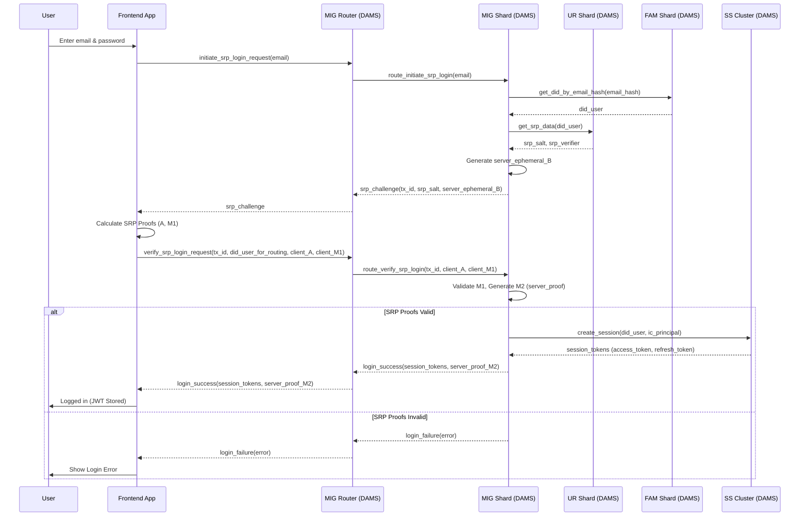
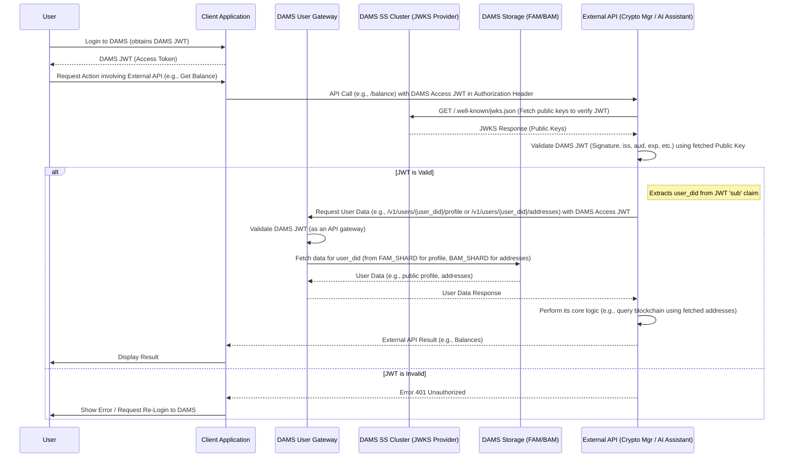

# KONG Wallet – Decentralized Account Management System (DAMS)

## Introduction

Welcome to the official repository of KONGWallet! KONGWallet is a next-generation crypto wallet, developed with the clear goal of making digital asset management easy, secure, and accessible to everyone—without compromising on decentralization or user control.

The project addresses key Web3 challenges such as the complexity of managing multiple wallets/blockchains, high and unpredictable fees, and barriers to mass adoption.

Our core backend (DAMS – Decentralized Account Management System) is being developed on the Internet Computer (ICP) using Rust. It incorporates innovative techniques such as a sharded architecture for scalability, the Atomic Saga Pattern for consistent transactions, and Verifiable Secret Sharing (VSS) for secure account recovery via a 3-of-5 threshold scheme. DAMS provides Decentralized Identity (DID) and issues JWTs for secure access to integrated services.

## Status: Beta Version Development

The project is currently in active beta development, focusing on the following core features and components:

### Beta Architecture Overview

The DAMS Beta architecture is built on the Internet Computer and features the following main canister types, designed for sharding and scalability:

-   **MIG Router (Main Integration Gateway Router)**: A stateless entry point and router that directs requests to the appropriate `MIG_SHARD`.
-   **MIG Shard (Main Integration Gateway Shard)**: A sharded canister that handles the business logic for registrations, logins, account linking, and orchestrates Atomic Saga transactions.
-   **FAM Shard (Federated Account Manager Shard)**: Sharded storage for user profiles, linked social accounts, and email hashes (for uniqueness checks).
-   **UR Shard (User Registry Shard)**: Sharded storage for SRP data (salt, verifier).
-   **BAM Shard (Blockchain Access Manager Shard)**: Sharded storage for blockchain addresses associated with user DIDs. Data from BAM Shard (and FAM Shard) will be accessible by the external Crypto Manager API via DAMS tokens.
-   **DDC Shard (DID Document Canister Shard)**: Sharded storage for public DID documents.
-   **ESS Shard (Encrypted Shard Storage Shard)**: Sharded storage for the two DAMS-managed encrypted VSS shares (indices 1 and 2 of the 3-of-5 scheme).
-   **SS Cluster (Session Service Cluster)**: Manages sessions, issues, and validates JWT access and refresh tokens. **Provides a public JWKS endpoint for token validation by external APIs.**
-   **UG (User Gateway)**: A JWT-protected API gateway for requests from authenticated users to their data and DAMS functions. **It will also provide endpoints for authorized access by external services (Crypto Manager API, AI Assistant) to public user data (profile, addresses) using DAMS tokens.**
-   **EAG (External API Gateway)**: Manages secure communication with external services, including OAuth providers (Google, Telegram). **It will also handle outbound requests to the external Crypto Manager API and AI Assistant if DAMS needs to initiate such communication.**

*The remaining VSS shares (indices 0, 3, 4) are client-managed and stored on the user's local device, Ceramic Network, and IPFS. DAMS does not directly interact with these client-side stores.*

### Innovative 3-of-5 VSS Security (Client-Orchestrated)

KONGWallet utilizes a 3-of-5 VSS scheme for account recovery, where the user manages the generation of shares. DAMS securely stores two of these shares (indices 1 and 2) in encrypted form within the `ESS Shards` on the Internet Computer.

-   Utilizes a 3-of-5 threshold scheme for maximum security and flexibility.
-   The client distributes the other 3 shares to user-chosen locations (local, Ceramic, IPFS).
-   Recovery is possible with any 3 out of the 5 shares and is performed client-side.

This architecture ensures decentralization and robust security while allowing for access recovery.

## Tech Stack

-   **Blockchain (DAMS Backend)**: Internet Computer (ICP)
-   **Language (Canisters)**: Rust
-   **Interfaces**: Candid
-   **Storage (DAMS Backend)**: `ic-stable-structures`
-   **Cryptography**: Ed25519 (for IC identity), Argon2id (for KDF with SRP), SHA-256/SHA-512, VSS.
-   **Key Concepts**: Decentralized Identifiers (DID), Atomic Saga Pattern, Sharding, Consistent Hashing, JWT, JWKS, OAuth 2.0, External API Integration.

## Beta Features

### I. Account Management & Security (DAMS Core)

-   **Registration**: Create a non-custodial DAMS account via:
    -   Email & Password (using SRP, atomic saga)
    -   Google Account (OAuth)
    -   Telegram Account (OAuth)
-   **Email Uniqueness**: Guaranteed during registration.
-   **IC Principal**: Generated from the client's seed phrase, serves as the primary identifier.
-   **VSS Security**: 3-of-5 threshold scheme, with 2 shares managed by DAMS on the IC.
-   **Login**: Via Email/Password (SRP), Google, or Telegram.
-   **Account Linking**: Ability to link Google/Telegram accounts to an existing DAMS DID.
-   **Session Tokens (JWT)**: Automatic retrieval of access and refresh tokens after successful login/registration, issued by the `SS_CLUSTER`. **These tokens will be used for authentication with the external Crypto Manager API and AI Assistant.**
-   **Account Recovery**: Primarily through a combination of 3 VSS shares (client-orchestrated).

### II. Integration with External Services (for Beta)

-   **Crypto Manager API Integration**:
    -   DAMS will serve as an Identity Provider (IdP), issuing JWTs for accessing an **external Crypto Manager API**.
    -   The external Crypto Manager API will validate DAMS tokens using a **JWKS endpoint** provided by DAMS.
    -   The external Crypto Manager API will be able to fetch (and cache) **public user profiles and linked blockchain addresses** from DAMS (via the `UG`), using the user's DAMS token for authorization.
    -   DAMS will **not** directly perform low-level crypto asset management operations; this is the responsibility of the external Crypto Manager API.
-   **AI Assistant Integration**:
    -   A similar integration pattern where DAMS provides identity and authorized data access for an **external AI Assistant**.

*(Note: The specific functionalities of the external Crypto Manager API and AI Assistant are outside the scope of DAMS core development. DAMS provides the identity, authentication, authorization, and data-access layer for them.)*

### III. Architectural Qualities

-   **Scalability**: Sharded system designed for millions of users.
-   **Atomicity**: Saga pattern for reliable multi-step operations.
-   **Reliability**: Idempotency, Circuit Breakers, Retry Logic.
-   **Security**: Defense in Depth, Principle of Least Privilege.

## Current Status & Progress (Q2 2025)

-   DAMS backend is in active development on ICP/Rust, focusing on **Epic 1 (Core Sharding & Logic)** and **Epic 2 (Full Storage Sharding & Saga)**.
-   The foundations of the `dams-shared` library and the `MIG_ROUTER` canister have been implemented.
-   The `MIG_SHARD` canister, with its saga and idempotency logic, is currently under development.
-   Integrations with the external Crypto Manager API and AI Assistant have been designed.

**Next Steps (Q2-Q3 2025)**: Finalize the Email/SRP registration and login flow in DAMS, implement the `SS_CLUSTER` with JWKS, the `UG` with API endpoints for external services, and the `EAG` for integrations. Prepare for testing these core functionalities.

## Team

*KONGWallet is built by a dedicated full-time team of 5 people (1 founder, 1 part-time senior designer, and 3 full-time developers with experience in Rust, Frontend (React Native/React/Next.JS), Backend (Nest.JS, Typescript), ML, and secure systems).*

*Martin – [Lead DEV]*

## Learn More:

-   [KONGWallet Website](https://kongwallet.io/)
-   [Follow us on Twitter](https://x.com/kongwallet)
-   [Telegram Community](#) (Coming Soon)
-   [Whitepaper](#) (Coming Soon)

## Architecture Diagrams

Here are diagrams illustrating key interaction flows based on the current architecture, including the approach where client applications interact with DAMS for authentication and then use DAMS-issued tokens to interact with external APIs, which in turn may fetch necessary user data from DAMS.

### Login Flow (SRP Example - DAMS Internal)

### External API Interaction Flow (Example: Crypto Manager API)

© 2025 KONG Wallet. All rights reserved.
