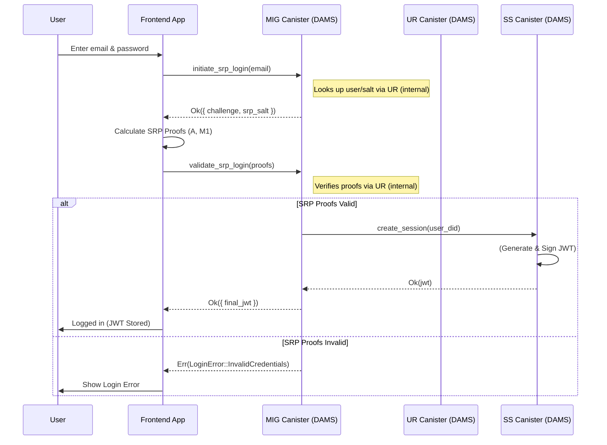
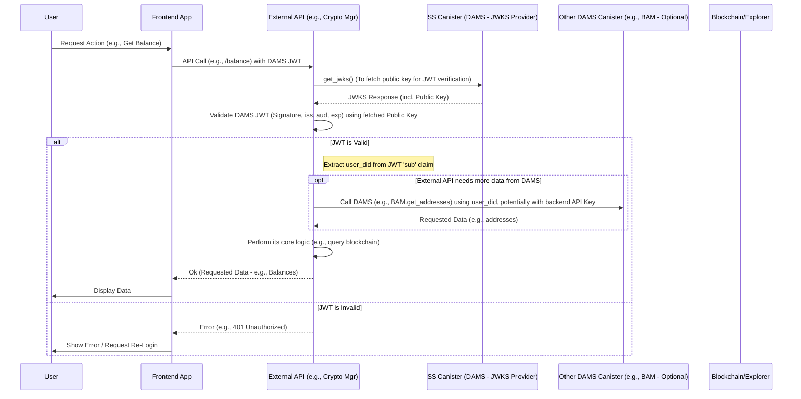

# KONG Wallet – Decentralized Account Management System (DAMS)

## Introduction

Welcome to the official repository of KONGWallet! KONGWallet is a next-generation crypto wallet, developed with the clear goal of making digital asset management easy, secure, and accessible to everyone—without compromising on decentralization or user control.

The project addresses key Web3 challenges such as the complexity of managing multiple wallets/blockchains, high and unpredictable fees, and barriers to mass adoption.

Our core backend (DAMS – Decentralized Account Management System) is being developed on the Internet Computer (ICP) using Rust. It incorporates innovative techniques such as Client-Side Key Derivation (CSKD) and Verifiable Secret Sharing (VSS) to enable secure account recovery with a 3-of-5 threshold scheme, and leverages DID-based authentication (DID Auth Flow) for secure access.

## Status: Beta Version

The project is currently in active beta development with the following core features and components:

### Beta Architecture Overview

Our Beta architecture focuses on the following primary Internet Computer canisters:

- **FAM** (FederatedAccountManager): User profile and identity management
- **UR** (UserRegistry): SRP data and account information management
- **SS** (SessionManager): Session, JWT, and JWKS management
- **MIG** (MainIntegrationGateway): Main entry point for registration and login
- **UG** (UserGateway): Secure gateway with JWT validation
- **EAG** (ExternalAPIGateway): Secure API calls to external networks
- **BAM** (BlockchainAccessManager): Blockchain account address management
- **ESS** (EncryptedShardStorage): Encrypted storage of sensitive data (x3 shards)
- **SNS** (SolanaNameServiceManager): Domain and subdomain management for VSS shards
- **CER** (CeramicManager): Integration with Ceramic Network for VSS shards
- **IPM** (IPFSManager): Integration with IPFS for VSS shards

### Innovative 3-of-5 VSS Security

KONGWallet introduces a revolutionary system for protecting crypto assets through decentralized distribution of VSS shards across five distinct locations:

- Utilizes a 3-of-5 threshold scheme for maximum security and flexibility
- Shards are distributed across various decentralized networks and locations
- Each shard is encrypted with a unique cryptographic key
- Recovery is possible with any 3 out of the 5 shards

This architecture ensures true decentralization and robust security while allowing access recovery in various loss or compromise scenarios.

## Tech Stack

- **Blockchain**: Internet Computer (ICP), Solana
- **Language (Canisters)**: Rust
- **Interfaces**: Candid
- **Storage**: ic-stable-structures, Ceramic Network, IPFS, Solana Name Service
- **Cryptography**: Ed25519, Argon2id (OWASP parameters), SHA-512, VSS instead of SSS
- **Key Concepts**: Decentralized Identifiers (DID), DID-based authentication, Client-Side Key Derivation (CSKD), Verifiable Secret Sharing (VSS), Multi-Chain Integration, External API Facade, Account Abstraction (AA – planned)

## Beta Features

### I. Account Management & Security

**Registration**: Create a non-custodial account via:
- Email & Password (using SRP)
- Google Account (OAuth)
- Telegram Account (OAuth / Login Widget)

**Seed Phrase**: Generated during registration; revealed for backup after first login (as part of onboarding)

**VSS Security**: 3-of-5 threshold scheme with shard distribution for maximum protection

**Login**: Via Email/Password (SRP), Google, or Telegram; secure retrieval of VSS shards; local decryption and VSS reconstruction of Seed Phrase in frontend

**API Access Token**: Automatically retrieved JWT token after successful login/registration for accessing Crypto Manager API

**Account Recovery**:
- Primary method: Using any combination of 3 VSS shards + 2FA verification
- Password reset (SRP only): Via email verification (does not recover private keys)

**Logout**: Session termination available

### II. Portfolio Management

**Dashboard**:
- Balance overview for SOL, TON, and connected SPL/Jetton tokens
- Display of individual amounts and approximate USD values
- Display of total portfolio value in USD

**AI Trending Integration**:
- View top 10 trending tokens in the Solana network

### III. Core Transactions

**Receive**: Display SOL and TON address / QR code

**Send**: Transfer SOL or TON to:
- Blockchain address (SOL/TON)
- Registered email in KONGWallet
- Registered Telegram username in KONGWallet

**Local Signing & Broadcasting**: Transactions signed locally in frontend and broadcasted directly from frontend (via drpc.org)

**Status Tracking**: Backend receives transaction hash and monitors status; frontend displays status (Pending/Confirmed/Failed)

### IV. Swaps

**Swap Interfaces**: Quick swap and manual swap (with slippage option)

**Supported DEXes**:
- SOL <> SPL tokens (via Jupiter)
- TON <> Jetton tokens (via STON.fi / Omniston Protocol)

**Execution**: Quote fetching from aggregators; local signing; direct broadcast from frontend; status tracking

### V. UX & Onboarding

**"Getting Started" Tasks**: Display and track task progress: "Backup Seed Phrase", "Receive SOL/TON for the first time", "Make your first Swap"

**Interface**: Accessible via mobile web browser and Telegram Mini-App (displays mobile web UI via main bot)

**VSS Shard UI**: Visualize shard status and access recovery tools

### VI. Scalability & Security

**Architecture for Millions**: Sharded system for efficient scaling and user servicing

**Decentralized Storage**: VSS shards distributed across independent locations

**Layered Security**: Each shard encrypted with a unique key

**Flexible Recovery**: Multiple recovery paths via various shard combinations

## Current Status & Progress (Q2 2025)

- DAMS backend in active development on ICP/Rust
- 3-of-5 VSS integration underway
- Testing in progress with decentralized networks (Ceramic, IPFS, SNS)

**Milestones Achieved (Q1 2025)**: Mobile Web v1 UI, initial Solana & TON integration (core features), AI Trending engine built (Solana), landing page launched, core DAMS implementation started

**Next Steps (Q2 2025)**: Finalize and stabilize DAMS & VSS implementation (TOP PRIORITY), launch Telegram Mini-App (Beta), publish Whitepaper (Draft), initiate Closed Alpha (Target: End of Q2/Start of Q3)

## Transition from Beta to Full Version

Our strategy for transitioning from Beta to full release includes:

**Beta Architecture Preparation**:
- Versioned API interfaces
- Abstracted layers for evolving components
- Clear separation of business and protocol-specific logic

**Phased Sharding Implementation**:
- Directory mechanisms for future sharding
- Gradual deployment of specialized directory canisters
- Progressive data redistribution during scaling

**Phased Security Enhancements**:
- Infrastructure prep for post-Beta security features
- WebAuthn/Passkeys as optional, then mandatory for new accounts
- Enhanced recovery system with Time Lock & Social Recovery

**Data Migration & Compatibility**:
- Version flags in user records
- Batch user migrations
- Backward compatibility during transition
- "Dual writing" approach during migration phase

## Team

KONGWallet is built by a dedicated full-time team of 5 people (1 founder, 1 part-time senior designer, and 3 full-time developers with experience in Rust, Frontend (React Native/React/Next.JS), Backend (Nest.JS, Typescript), ML, and secure systems).

Martin – [Lead DEV]

## Learn More:

- [KONGWallet Website](https://kongwallet.io/)
- [Follow us on Twitter](https://x.com/kongwallet)
- [Telegram Community](#) (Coming Soon)
- [Whitepaper](#) (Coming Soon)

## Architecture Diagrams

Here are diagrams illustrating key interaction flows based on the current architecture, including the approach where the Frontend calls external APIs directly after obtaining a JWT from DAMS.

### Login Flow (SRP Example)

### External API Interaction Flow (Example: Crypto Manager API)

© 2025 KONG Wallet. All rights reserved.
